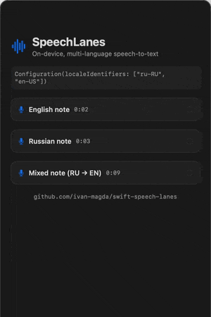

# SpeechLanes

[](https://github.com/ivan-magda/swift-speech-lanes/actions/workflows/swift.yml)
[](https://swift.org)
[](https://developer.apple.com)
[](https://swift.org/package-manager/)
[](LICENSE)

On-device, multi-language speech-to-text for Apple platforms. Give it an audio file and an ordered list of locales; it runs one transcription lane per locale on Apple's `SpeechAnalyzer` stack and returns the best transcript, picked by the engine's own confidence.

<p align="left">
  
</p>

```swift
let transcriber = SpeechLaneTranscriber(
    configuration: Configuration(localeIdentifiers: ["en-US", "ru-RU"])
)
let result = try await transcriber.transcribe(audioFileAt: audioURL)
print(result.text) // the best transcript across both languages
```

## Table of Contents

- [Background](#background)
- [Features](#features)
- [Requirements](#requirements)
- [Installation](#installation)
- [Usage](#usage)
- [How It Works](#how-it-works)
- [Project Structure](#project-structure)
- [Contributing](#contributing)
- [License](#license)

## Background

Apple's `SpeechAnalyzer` (macOS 26 / iOS 26) transcribes on-device with no network and no permission prompt, but it has **no audio language detection**, and each transcriber covers a **single locale**. Apple also ships `SpeechTranscriber` models for only some languages: Russian, for example, has no `SpeechTranscriber` model and must fall back to `DictationTranscriber`, the system-dictation engine.

Supporting more than one language takes more than one API call. You have to run each candidate locale yourself, pick the right transcriber for each, provision its model, and then decide which output to trust, because a mismatched-language lane returns confident-looking garbage instead of staying silent.

SpeechLanes does that work for you. It runs one **lane** per configured locale, chooses `SpeechTranscriber` where a model exists and `DictationTranscriber` otherwise, and lets a confidence arbiter pick the winner. SpeechLanes began as the transcription engine of a production Telegram assistant that answers spoken messages in English and Russian.

## Features

- **Multi-locale.** One lane per configured locale, tried in priority order. A lane that matches the audio wins; the rest never run.
- **Automatic engine selection.** `SpeechTranscriber` where Apple ships a model for the locale, `DictationTranscriber` fallback (for example `ru-RU`).
- **Confidence arbitration.** A lane above `acceptConfidence` wins outright; otherwise the highest-confidence lane above a floor wins; audio matching no configured language fails with a typed `lowConfidence` error instead of returning plausible-looking nonsense.
- **Resilient.** One lane's engine failure never takes down a language that still works.
- **Idempotent model provisioning.** Reserves, evicts stale reservations, and downloads assets on first use; offline afterwards.
- **Any decodable audio.** Anything `AVAudioFile` can open: Telegram-shaped Ogg/Opus, MP3, M4A, CAF, WAV. `AVAudioFile` sniffs the content, so the file extension is irrelevant.
- **Bounded and cancellable.** Optional decoded-duration cap, and the engine honors task cancellation so you can wrap it in a timeout.
- **Swift 6, strict concurrency.** A `Sendable` actor behind a small injectable protocol, with typed throws. Zero third-party dependencies.

## Requirements

- iOS 26.0+ / macOS 26.0+ / visionOS 26.0+
- Swift 6.2+ / Xcode 26+
- Runs on-device. The only network access is the one-time model download the first time you use a locale; the OS shares those models system-wide afterwards.

## Installation

### Xcode

1. Open **File → Add Package Dependencies…**
2. Enter the URL: `https://github.com/ivan-magda/swift-speech-lanes.git`
3. Choose the `SpeechLanes` library and add it to your target.

### Package.swift

Add the package to your dependencies:

```swift
dependencies: [
    .package(
        url: "https://github.com/ivan-magda/swift-speech-lanes.git",
        from: "1.0.0"
    )
]
```

Then add the product to your target:

```swift
.target(
    name: "YourTarget",
    dependencies: [
        .product(name: "SpeechLanes", package: "swift-speech-lanes")
    ]
)
```

## Usage

### Basic

Configure one or more locales and hand the transcriber a file URL.

```swift
import SpeechLanes

let transcriber = SpeechLaneTranscriber(
    configuration: Configuration(localeIdentifiers: ["en-US"])
)
let result = try await transcriber.transcribe(audioFileAt: audioURL)
print(result.text)
```

### Multiple locales

List every language the audio might be in, most likely first. Each becomes a lane; the first lane whose confidence clears `acceptConfidence` wins without running the rest, so ordering hints at the likely match without constraining it.

```swift
let transcriber = SpeechLaneTranscriber(
    configuration: Configuration(localeIdentifiers: ["en-US", "ru-RU"])
)
let result = try await transcriber.transcribe(audioFileAt: audioURL)
```

You can pass `Locale` values directly instead of identifier strings:

```swift
Configuration(locales: [Locale(identifier: "en-US"), Locale(identifier: "ru-RU")])
```

### Mixed-language audio

A file that switches languages mid-recording settles on a **single winning lane**, and that lane transcribes the whole file. Phrases in the other language survive only as well as the winning engine handles them; the `ru-RU` dictation model, for example, carries embedded English. The arbiter chooses that one lane and rejects confident wrong-language output, rather than stitching transcripts across lanes. The live suite exercises this with a bundled Russian-then-English fixture (`voice-note-mixed.oga`).

### Inspecting the result

`TranscriptionResult` carries the provenance you need to decide how much to trust the text.

```swift
let result = try await transcriber.transcribe(audioFileAt: audioURL)
result.text        // "the quick brown fox…"
result.locale      // the lane that won, e.g. ru-RU
result.confidence  // averaged per-word confidence, or nil if the engine reported none
result.engine      // .speech or .dictation
```

### Handling failures

Every failure is a typed `TranscriptionError`, so you can map each to a message.

```swift
do {
    let result = try await transcriber.transcribe(audioFileAt: audioURL)
    handle(result.text)
} catch let error as TranscriptionError {
    switch error {
    case .lowConfidence:
        show("I couldn't make out that audio in any configured language.")
    case .audioTooLong:
        show("That clip is too long to transcribe.")
    case .unavailable, .localeUnsupported, .assetsUnavailable:
        show("Transcription isn't available on this device yet.")
    case .undecodableAudio:
        show("I couldn't decode that audio.")
    case .transcriptionFailed, .cancelled:
        show("Something went wrong. Please try again.")
    }
}
```

### Capping audio duration

Set `maximumAudioDuration` to reject long audio before the engine runs. The check reads the **decoded** length, so a forged container header can't spoof it.

```swift
Configuration(localeIdentifiers: ["en-US"], maximumAudioDuration: .seconds(600))
```

### Bounding with a timeout

The engine has no built-in deadline, but it honors task cancellation. A cancelled task abandons a wedged analyzer and throws `.cancelled`. Wrap the call in a task group to impose one:

```swift
extension SpeechLaneTranscriber {
    func transcribe(
        audioFileAt url: URL,
        timeout: Duration
    ) async throws -> TranscriptionResult {
        try await withThrowingTaskGroup(of: TranscriptionResult.self) { group in
            group.addTask { try await self.transcribe(audioFileAt: url) }
            group.addTask {
                try await Task.sleep(for: timeout)
                throw TranscriptionError.cancelled
            }
            defer { group.cancelAll() }
            guard let winner = try await group.next() else {
                throw TranscriptionError.cancelled
            }
            return winner
        }
    }
}
```

### Testing with a fake

`SpeechLaneTranscriber` conforms to `SpeechTranscribing`, so app code can depend on the protocol and inject a fake: no speech stack, no audio, no async model download in your unit tests.

```swift
struct StubTranscriber: SpeechTranscribing {
    let result: TranscriptionResult
    func transcribe(audioFileAt url: URL) async throws(TranscriptionError) -> TranscriptionResult {
        result
    }
}
```

## How It Works

1. **Resolve.** Each configured locale becomes a lane. `LaneResolver` matches an exact BCP-47 tag first, then widens a partial tag (`ru` → `ru_RU`) through the engine's own equivalence, counting the result only when that engine supports it. A locale with a `SpeechTranscriber` model becomes a `.speech` lane; otherwise it falls back to a `.dictation` lane.
2. **Guard.** `DurationGuard` opens the audio once with `AVAudioFile` and checks its decoded duration against `maximumAudioDuration`.
3. **Run.** Lanes run in priority order. Each provisions its model (idempotently), analyzes the file through `SpeechAnalyzer`, and averages the engine's per-word confidence. A lane clearing `acceptConfidence` (default `0.6`) returns immediately.
4. **Arbitrate.** If no lane cleared the accept threshold, the highest-confidence lane above `floorConfidence` (default `0.3`) wins. If every lane scored below the floor, the result is `lowConfidence`. The defaults sit inside the measured separation between a matching language (≥ 0.84 average) and a mismatched one (≤ 0.21). The arbiter remembers a lane that failed outright and surfaces it only when no lane produced a usable transcript, so a generic "couldn't make it out" never hides a real, actionable fault.

## Project Structure

```
Sources/SpeechLanes/
├── Transcriber/
│   ├── SpeechLaneTranscriber.swift   // Public actor: orchestrates the lanes, settles the winner
│   └── SpeechTranscribing.swift      // The injectable protocol seam
├── Model/
│   ├── Configuration.swift           // Locales + confidence thresholds + duration cap
│   ├── TranscriptionResult.swift     // Winning text, locale, confidence, engine
│   ├── TranscriberEngine.swift       // .speech | .dictation
│   ├── TranscriptionError.swift      // Typed failure modes
│   └── ScoredTranscript.swift        // One lane's scored output
├── Lanes/
│   ├── Lane.swift                    // A resolved locale bound to its engine
│   ├── LaneResolver.swift            // Locale → lane (exact tag, then equivalence widening)
│   ├── LaneExecutor.swift            // Runs a lane through SpeechAnalyzer
│   ├── LaneArbiter.swift             // Pure confidence-based winner selection
│   ├── AssetProvisioner.swift        // Idempotent model reserve / evict / install
│   └── DurationGuard.swift           // Ground-truth decoded-duration cap
└── Extensions/
    └── Locale+BCP47.swift            // Folded BCP-47 tag for locale identity
```

## Contributing

Issues and pull requests are welcome. The package builds and tests with:

```bash
swift build
swift test
```

The deterministic suite runs anywhere the package builds. The end-to-end engine tests are opt-in, since they transcribe on real hardware and may download model assets on first run:

```bash
SPEECHLANES_LIVE_TESTS=1 swift test
```

Lint with `swiftlint --strict` before opening a pull request.

## License

Released under the MIT License. See [LICENSE](LICENSE) for the full text.
